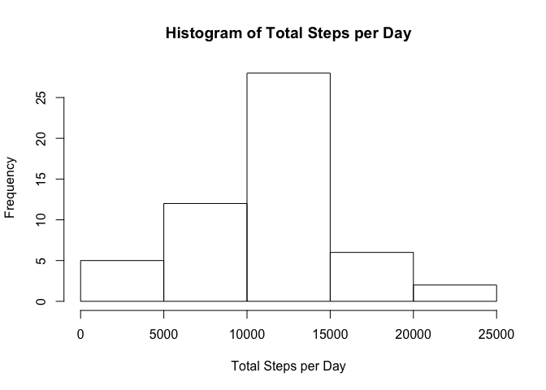
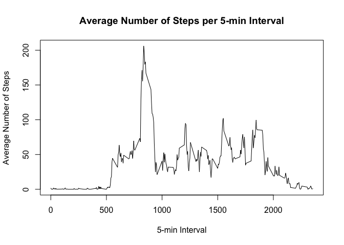
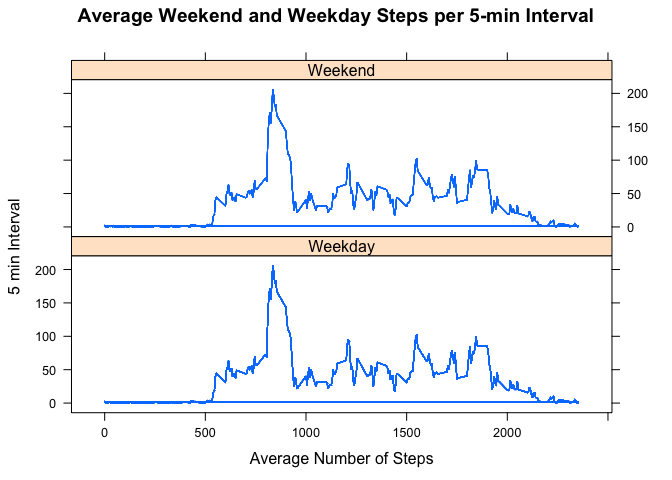

This assignment requires the analysis of data collected from a personal activity monitoring device. The device collects data on the number of steps taken during 5-min intervals from October to November, 2012. The data for this assignment is available at https://d396qusza40orc.cloudfront.net/repdata%2Fdata%2Factivity.zip.

## Loading and Preprocessing the Data


*1. Load the data*

First the necessary libraries for this analysis were loaded in RStudio.


```
## 
## Attaching package: 'dplyr'
```

```
## The following objects are masked from 'package:stats':
## 
##     filter, lag
```

```
## The following objects are masked from 'package:base':
## 
##     intersect, setdiff, setequal, union
```

```
## 
## Attaching package: 'lubridate'
```

```
## The following object is masked from 'package:base':
## 
##     date
```

The data was downloaded, the location of which was set as the Working Directory in RStudio. The activity datafile was read into R and examined.


```r
setwd("~/Documents/bio_inf/Data_Science_Specialization/Reproducible Research/Week 2/Course Project 1")
act1 <- read.csv("activity.csv", header = TRUE)
dim(act1)
```

```
## [1] 17568     3
```

```r
head(act1)
```

```
##   steps       date interval
## 1    NA 2012-10-01        0
## 2    NA 2012-10-01        5
## 3    NA 2012-10-01       10
## 4    NA 2012-10-01       15
## 5    NA 2012-10-01       20
## 6    NA 2012-10-01       25
```


*2. Process/transform the data into a format suitable for your analysis*

As you can see, the activity.csv dataset contained 17568 observations, and 3 columns entitled, "steps", "date", and "interval". The data required some initial preprocessing. There was a lot of missing data (NAs) within the "steps" column. Those rows were initially removed from the dataset. Additionally, the "date" column changed into date format using the lubridate ymd (year-month-day) function.


```r
act2 <- filter(act1, !is.na(act1$steps))
class(act2$date)
```

```
## [1] "factor"
```

```r
act2$date <- ymd(act2$date)
class(act2$date)
```

```
## [1] "Date"
```


### What is the Mean Total Number of Steps Taken per Day?


*1. Calculate the total number of steps taken per day*

The number of steps for each day was totaled using a aggregate function. The columns of the resulting dataframe were relabeled to "Date" and "TotalSteps"


```r
act3 <- aggregate(act2$steps, by=list(act2$date), sum)
colnames(act3) <- c("Date", "TotalSteps")
```


*2. Make a histogram of the total number of steps taken each day*

The histogram function from the R base plotting system was used to make a histogram of the total steps taken each day.


```r
hist1 <- hist(act3$TotalSteps, main = "Histogram of Total Steps per Day", xlab = "Total Steps per Day") 
```

<!-- -->


*3. Calculate and report the mean and median of the total number of steps taken per day*


```r
summary(act3)
```

```
##       Date              TotalSteps   
##  Min.   :2012-10-02   Min.   :   41  
##  1st Qu.:2012-10-16   1st Qu.: 8841  
##  Median :2012-10-29   Median :10765  
##  Mean   :2012-10-30   Mean   :10766  
##  3rd Qu.:2012-11-16   3rd Qu.:13294  
##  Max.   :2012-11-29   Max.   :21194
```

The summary function reports the mean number of steps as **10766** and the median number of steps as **10765**.


### What is the Average Daily Activity Pattern?


*1. Make a time series plot (i.e. type="l") of the 5-minute interval (x-axis) and the average number of steps taken, averaged across all days (y-axis)*

In order to create the time series plot, the average number of steps taken per interval was calculated using the aggregate function. The columns of the resulting dataframe were renamed in order to avoid confusion. The base plotting system was then used to make the time series line plot. 


```r
act4 <- aggregate(act2$steps, by=list(act2$interval), mean) 
colnames(act4) <- c("Interval", "AverageSteps") 
plot2 <- with(act4, plot(Interval, AverageSteps, type = "l", main = "Average Number of Steps per 5-min Interval", ylab = "Average Number of Steps", xlab = "5-min Interval")) 
```

<!-- -->


*Which 5-minute interval, on average across all the days in the dataset, contains the maximum number of steps?*

In order to answer this question, the dataset was sorted by AverageSteps descending order.


```r
act5 <- arrange(act4, desc(AverageSteps))
head(act5) 
```

```
##   Interval AverageSteps
## 1      835     206.1698
## 2      840     195.9245
## 3      850     183.3962
## 4      845     179.5660
## 5      830     177.3019
## 6      820     171.1509
```

The 5-min interval with maximum number of steps was **835**.


### Imputing Missing Values


*1. Calculate and report the total number of missing values in the dataset (i.e. the total number of rows with NAs)*


```r
sum(is.na(act1))
```

```
## [1] 2304
```

The total number of NAs in the dataset was **2304**. This code works because all of the missing data is in the "steps" column and therefore, there is only one NA per row.


*2. Devise a strategy for filling in all of the missing values in the dataset. The strategy does not need to be sophisticated. For example, you could use the mean/median for that day, or the mean for that 5-minute interval, etc.*

The mean number of steps taken during that time interval, over several days, seemed like the best strategy for filling in the missing data. This was achieved by merging the initial dataset with the one containing the average number of steps by interval. 


```r
act6 <- merge(act1, act4, by.x = "interval", by.y = "Interval")
```


*3. Create a new dataset that is equal to the original dataset but with the missing data filled in.*

The missing steps values (NAs) were then replaced with the average number of steps corresponding to that interval. The new dataset was then sorted by date for easy comparison with the original dataset.


```r
act6$steps[is.na(act6$steps)] <- act6$AverageSteps[is.na(act6$steps)] 
act6 <- arrange(act6, date) 
```


*4. Make a histogram of the total number of steps taken each day and Calculate and report the mean and median total number of steps taken per day.*

As before, the number of steps for each day was totaled using a aggregate function and histogram of the total steps taken each day was created using the base plotting system. 


```r
act7 <- aggregate(act6$steps, by=list(act6$date), sum) 
colnames(act7) <- c("Date", "TotalSteps") 
hist2 <- hist(act7$TotalSteps, main = "Histogram of Total Steps per Day", xlab = "Total Steps per Day") 
```

<!-- -->

```r
summary(act7)
```

```
##          Date      TotalSteps   
##  2012-10-01: 1   Min.   :   41  
##  2012-10-02: 1   1st Qu.: 9819  
##  2012-10-03: 1   Median :10766  
##  2012-10-04: 1   Mean   :10766  
##  2012-10-05: 1   3rd Qu.:12811  
##  2012-10-06: 1   Max.   :21194  
##  (Other)   :55
```

The summary function was used to find the mean, **10766**, and median, **10766**, number of steps taken per day. 


*Do these values differ from the estimates from the first part of the assignment? What is the impact of imputing missing data on the estimates of the total daily number of steps?*

The mean number of steps per day is the same and the median varies by one, between the datasets omitting the missing data and one with inputted data. Even though the values for the 1st and 3rd Quartiles did differ slightly, there was very little impact on the total daily number of steps with this method for inputting missing values.


### Are there differences in activity patterns between weekdays and weekends?


*1. Create a new factor variable in the dataset with two levels – “weekday” and “weekend” indicating whether a given date is a weekday or weekend day.*

A copy of the act6 dataset was created in order to avoid confusion. The precise day of the week was found using the weekdays function and recorded in the column "Days". From this data, a new column was created, "Weekday"", that indicated whether the day was a weekday or weekend. 


```r
act6wd <- act6
act6wd$Day <- weekdays(ymd(act6$date))
act8 <- mutate(act6wd, Weekday = ifelse(act6wd$Day %in% c("Saturday", "Sunday"), "Weekend", "Weekday"))
```

*2.	Make a panel plot containing a time series plot (i.e. type="l") of the 5-minute interval (x-axis) and the average number of steps taken, averaged across all weekday days or weekend days (y-axis).*

The lattice plotting system was used to create a panel plot of the time series between weekdays and weekends. 


```r
xyplot(AverageSteps ~ interval | Weekday, data = act8, layout = c(1,2), type = "l", main = "Average Weekend and Weekday Steps per 5-min Interval", xlab = "Average Number of Steps", ylab = "5 min Interval")
```

<!-- -->
 
